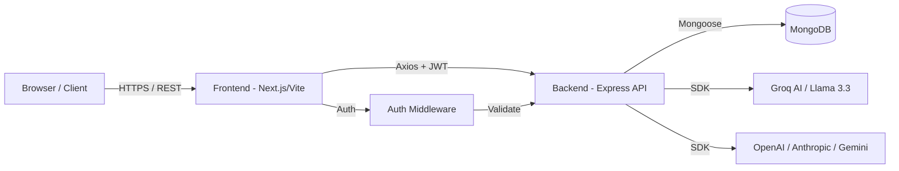

# AgentLens — Enterprise AI Orchestration & Optimization Platform

AgentLens is a production-grade AI governance platform designed to help organizations orchestrate, monitor, and optimize their AI tool ecosystem. It provides semantic tool routing, automated spend analysis, carbon footprint tracking, and policy-driven workflow validation.

[](https://nodejs.org/)
[](https://github.com/)
[](https://opensource.org/licenses/ISC)
[](https://agent-lens-frontend.vercel.app)

---

## Table of Contents
1. [Project Overview](#1-project-overview)
2. [Live Demo](#2-live-demo)
3. [Core Features](#3-core-features)
4. [System Architecture](#4-system-architecture)
5. [Frontend Architecture](#5-frontend-architecture)
6. [Backend Architecture](#6-backend-architecture)
7. [Recommendation Engine — Deep Dive](#7-recommendation-engine--deep-dive)
8. [Database Schema](#8-database-schema)
9. [API Reference](#9-api-reference)
10. [Environment Variables](#10-environment-variables)
11. [Installation & Local Development](#11-installation--local-development)
12. [Database Setup & Seeding](#12-database-setup--seeding)
13. [Deployment](#13-deployment)
14. [Tech Stack](#14-tech-stack)
15. [Folder Structure](#15-folder-structure)
16. [Engineering Decisions & Tradeoffs](#16-engineering-decisions--tradeoffs)
17. [Known Limitations & Current State](#17-known-limitations--current-state)
18. [Future Improvements](#18-future-improvements)
19. [Contributing](#19-contributing)
20. [License](#20-license)

---

## 1. Project Overview
AgentLens addresses the "AI Wild West" in modern enterprises where teams adopt various AI tools (SaaS sprawl) without centralized oversight. It solves three critical problems:
- **Optimization:** Identifying overlapping tool capabilities to eliminate redundant subscriptions.
- **Orchestration:** Determining the most cost-effective and highest-quality tool chain for a specific task.
- **Sustainability:** Tracking the environmental impact (CO2 and water) of AI inference at scale.

**Technical Summary:** The system is built as a React-based "Command Center" dashboard communicating with a Node.js/Express orchestration backend. It leverages the Groq Llama 3.3 70B model for semantic analysis and reasoning, while using deterministic algorithms for tool ranking and cost estimation. The platform is now fully private, requiring user authentication and enforcing strict multi-tenant data isolation.

---

## 2. Live Demo
- **Frontend:** [https://agent-lens-frontend.vercel.app](https://agent-lens-frontend.vercel.app)
- **Backend Health Check:** [https://agent-lensbackend.onrender.com/api/](https://agent-lensbackend.onrender.com/api/)
- **Test Credentials:** Sign up for a private account to access the dashboard.


---

## 3. Core Features

### Multi-Tenant Data Isolation
- **What it does:** Ensures that users only see data (dashboards, metrics, workflows) belonging to their organization.
- **Technical Detail:** Implements JWT-based authentication and a `protect` middleware that injects the user's organization context into every database query.
- **Files:** `src/middleware/auth.middleware.js`, `src/controllers/auth.controller.js`

### Universal Prompt Launcher & Orchestration
- **What it does:** Provides a seamless "Copy and Redirect" flow for prompt management across external AI services (Perplexity, Claude, ChatGPT).
- **Technical Detail:** Acts as an intelligent workflow router, generating optimized prompts and providing direct handoffs to the best-fit model for the task.
- **Files:** `src/controllers/recommendation.controller.js`, `src/routes/workflow.routes.js`

### Hybrid Recommendation Engine
- **What it does:** Suggests a multi-step workflow of AI tools for a specific task (e.g., "Build a React App").
- **Technical Detail:** Combines a deterministic weighted keyword-matching algorithm with LLM-based reasoning (Groq, Anthropic, or Gemini).
- **Files:** `src/recommendation-engine/engine.js`, `src/algorithms/scoring.algorithm.js`

### Spend & Overlap Analytics
- **What it does:** Detects semantic redundancies between active subscriptions (e.g., ChatGPT vs Claude).
- **Technical Detail:** Uses Jaccard similarity for keyword sets and semantic analysis to find 75%+ capability overlaps.
- **Files:** `src/analytics/spend.analytics.js`, `src/algorithms/overlap.algorithm.js`

### Sustainability Dashboard
- **What it does:** Visualizes CO2 emissions and water cooling impact per AI request.
- **Technical Detail:** Aggregates metrics from `AITool` metadata based on historical `UsageAnalytics`. Calculates water footprint based on tool category (Video > Image > Text).
- **Files:** `src/controllers/analytics.controller.js` (Method: `getCarbonAnalytics`)

### Governance & Policy Simulation
- **What it does:** Validates if a proposed workflow violates organization-wide tool restrictions.
- **Technical Detail:** Checks `Workflow` objects against `Organization` policy fields (`restrictedTools`) and team-specific budgets.
- **Files:** `src/controllers/workflow.controller.js`

---

## 4. System Architecture

### High-Level Diagram


### Request Lifecycle
1. **User Action:** User submits a task in the `Recommend.jsx` page.
2. **Component:** `Recommend` component calls `recommendationService.js`.
3. **API Call:** Axios sends a POST request to `/api/recommendations`.
4. **Middleware:** `apiLimiter` checks traffic; `express.json()` parses body.
5. **Controller:** `recommendation.controller.js` validates input and calls the engine.
6. **Service:** `scoring.algorithm.js` ranks tools; `groq.provider.js` generates reasoning.
7. **DB:** `analytics.service.js` saves the execution record to `UsageAnalytics`.
8. **Response:** Backend returns structured JSON with the orchestration flow.
9. **UI Update:** `WorkflowVisualizer` renders the steps with Framer Motion animations.

### Middleware Stack (in order)
1. `helmet({ contentSecurityPolicy: false })`: Sets security headers.
2. `cors()`: Whitelists specific frontend origins with credentials support.
3. `express.json()`: Parses JSON payloads.
4. `express.urlencoded()`: Parses URL-encoded data.
5. `cookieParser()`: Parses session/auth cookies.
6. `morgan("dev")`: Logs HTTP requests to console.
7. `apiLimiter`: Prevents brute force (30 req/min).
8. `protect`: Custom JWT authentication middleware (for scoped routes).
9. `errorHandler`: Centralized error catching and logging via Winston.

---

## 5. Frontend Architecture
- **Framework:** React 19 + Vite 8
- **Styling:** Tailwind CSS 4 (using `@tailwindcss/vite` plugin)
- **State Management:** Local `useState` + React Context for global notifications.
- **API Communication:** Axios instance with `baseURL` from `VITE_API_URL`.

### Component Hierarchy
- `App.jsx`
  - `CinematicLoader` (GSAP entrance)
  - `AppRoutes`
    - `MainLayout`
      - `Sidebar` (Lucide-React icons, Framer Motion hover)
      - `Topbar`
      - `Outlet` (Page Components)

### Key Pages
- `Dashboard.jsx`: Executive summary with Recharts visualizations.
- `Tools.jsx`: Interactive catalog of 50+ AI tools with category filters.
- `Recommend.jsx`: Input for the orchestration engine.
- `Organization.jsx`: Management interface for teams and subscriptions.

---

## 6. Backend Architecture
The backend follows a strict **Controller-Service-Route** pattern to ensure clean separation of concerns.

- **Express Setup:** CommonJS modules, structured for high-throughput AI requests.
- **Error Handling:** Uses a custom `ApiError` utility and a global `errorHandler` middleware.
- **Security:** Helmet for headers, CORS for origin protection, `express-rate-limit` for DDoS prevention, and JWT for resource isolation.
- **Multi-Tenancy:** Every request is organization-scoped after authentication.

---

## 7. Recommendation Engine — Deep Dive

The core intelligence of AgentLens lies in its **Hybrid Scoring Logic**.

### Scoring Math
Baseline Score: **25**
1. **Capability Match (0-40 pts):** `matchCount * 5`. Keywords in task matched against tool `strengths` and `bestFor`.
2. **Category Bonus (+3 pts):** If tool category matches primary task category.
3. **Popularity (0-15 pts):** `(popularityScore / 100) * 15`.
4. **Context Window (0-10 pts):** `Math.min(Math.log10(contextWindow) * 2, 10)`.
5. **Budget Weighting (0-20 pts):**
   - **Low:** Free tools = +20, <=$10 = +15.
   - **Medium:** <=$25 = +15, else +5.
6. **Priority Weighting (0-15 pts):**
   - **Quality:** Based on popularity score.
   - **Speed:** Context window > 100k = +10, strengths includes "fast" = +5.
   - **Cost:** `Math.max(0, 15 - price / 5)`.

### Orchestration Strategy
The engine picks the top 2-4 tools that are **strictly complementary** (one per category and one per provider) to build a multi-step workflow.

---

## 8. Database Schema

### AITool Collection
| Field | Type | Required | Description |
|-------|------|----------|-------------|
| name | String | Yes | Unique name of the tool |
| provider | String | Yes | Company (e.g., OpenAI) |
| category | String | Yes | Primary function (e.g., coding) |
| website | String | Yes | Launch URL for the tool |
| monthlyPrice | Number | No | USD price per month |
| contextWindow | Number | No | Max tokens in context |
| carbonPerRequest| Number | No | Grams of CO2 per request |
| waterPerRequest | Number | No | Milliliters of water per request |

### Organization Collection
| Field | Type | Required | Description |
|-------|------|----------|-------------|
| name | String | Yes | Organization name |
| industry | String | Yes | Sector (e.g., Finance) |
| teams | Array | No | List of team objects with budgets |
| subscriptions | Array | No | Active tool names |

---

## 9. API Reference

### POST /api/auth/register
- **Description:** Creates a new user and links them to an organization.
- **Body:** `{ "name": "string", "email": "string", "password": "string", "organizationName": "string" }`

### POST /api/auth/login
- **Description:** Authenticates user and returns a JWT in a secure cookie.
- **Body:** `{ "email": "string", "password": "string" }`

### GET /api/tools
- **Description:** Returns the full catalog of AI tools. (Public)
- **Query Params:** `?category=coding`

### POST /api/recommendations (Auth Required)
- **Description:** Generates tool recommendations and AI reasoning.
- **Body:** `{ "task": "string", "budget": "low/med/high", "priority": "quality/speed/cost" }`

### GET /api/analytics/carbon (Auth Required)
- **Description:** Returns environmental impact metrics for the user's organization.
- **Returns:** `totalCarbonGrams`, `totalWaterConsumedMl`, `treesNeeded`, `impactLevel`.

---

## 10. Environment Variables

| Variable | Required | Purpose | Example |
|----------|----------|---------|---------|
| `MONGO_URI` | Yes | MongoDB Connection String | `mongodb+srv://...` |
| `GROQ_API_KEY` | Yes | Key for Llama 3.3 Inference | `gsk_...` |
| `JWT_SECRET` | Yes | Secret for signing auth tokens | `super-secret-key` |
| `JWT_EXPIRES_IN` | Yes | Token expiration duration | `7d` |
| `PORT` | No | Server port (defaults to 5000) | `5000` |
| `ANTHROPIC_API_KEY` | No | Key for Claude models | `sk-ant-...` |
| `GEMINI_API_KEY` | No | Key for Google Gemini models | `...` |
| `OPENAI_API_KEY` | No | Optional key for GPT-4 fallback | `sk_...` |
| `VITE_API_URL` | Yes | (Frontend) Backend Base URL | `http://localhost:5000` |

---

## 11. Installation & Local Development

### Backend
```bash
cd backend
npm install
# Create .env with MONGO_URI and GROQ_API_KEY
npm run dev
```

### Frontend
```bash
cd frontend
npm install
# Create .env with VITE_API_URL=http://localhost:5000
npm run dev
```

---

## 12. Database Setup & Seeding
The database must be initialized with the tool catalog for the recommendation engine to function.
- **Seed Script:** `backend/src/seed/seedTools.js`
- **Command:** `node src/seed/seedTools.js` (inside backend directory)
- **Impact:** Populates `aitools` collection with 50+ real-world tool entries and calculates randomized sustainability metrics.

---

## 13. Deployment

- **Frontend (Vercel):**
  - Build Command: `npm run build`
  - Output Directory: `dist`
  - Env Var: `VITE_API_URL`
- **Backend (Render):**
  - Build Command: `npm install`
  - Start Command: `node src/server.js`
  - Env Var: `MONGO_URI`, `GROQ_API_KEY`
- **CORS:** Ensure `origin` in `app.js` matches the Vercel deployment URL.

---

## 14. Tech Stack
| Layer | Technology | Version | Why chosen |
|-------|------------|---------|------------|
| Frontend | React 19 | v19.0.0 | Latest concurrent features |
| UI/Motion | Framer Motion | v12.0.0 | Fluid dashboard transitions |
| Visualization | Recharts | v3.8.1 | High-performance SVG charts |
| Backend | Express 5 | v5.2.1 | Lightweight & battle-tested |
| Auth | JWT + Bcrypt | v9.0.3 / v3.0.3 | Secure, stateless multi-tenancy |
| Database | MongoDB | v9.6.1 | Schema flexibility for tool metadata |
| AI Orchestration | Groq, Anthropic, Gemini | Mixed | Multi-model routing capabilities |

---

## 15. Folder Structure
```text
├── backend
│   ├── src
│   │   ├── algorithms/    # Deterministic scoring & overlap math
│   │   ├── analytics/     # Business logic for executive reporting
│   │   ├── controllers/   # Route handlers
│   │   ├── models/        # Mongoose schemas
│   │   ├── routes/        # API endpoint definitions
│   │   └── ai-providers/  # LLM integration wrappers (Groq, OpenAI)
└── frontend
    ├── src
    │   ├── components/    # Glassmorphic UI elements
    │   ├── pages/         # Top-level view components
    │   ├── services/      # Axios API abstractions
    │   └── layouts/       # Persistent shell (Sidebar/Topbar)
```

---

## 16. Engineering Decisions & Tradeoffs
- **Decision:** Chose a "Layered Monolith" over Microservices.
- **Why:** Faster iteration for the MVP phase.
- **Tradeoff:** Scaling specific analytics routes will eventually require more complex infrastructure.

- **Decision:** Use Groq as the primary inference engine.
- **Why:** Extremely low TTFT (Time To First Token) for real-time dashboard updates.
- **Tradeoff:** Limited to models supported by Groq (Llama, Mixtral).

---

## 17. Known Limitations & Current State
- ⚠️ **Caching:** Recommendation results are not currently cached (may lead to Groq rate limits).
- ⚠️ **History:** "View All" workflows in the dashboard links to a stub.
- ⚠️ **Mock Data:** Sustainability scores are partially randomized if real data is unavailable.

---

## 18. Future Improvements
- **Semantic Search:** Replace keyword scoring with a Vector DB (Pinecone) for better tool matching.
- **Background Jobs:** Move executive report generation to a BullMQ worker to handle large data sets.
- **Real-time:** Implement WebSockets for live collaborative workflow design.
- **Multi-Cloud:** Add support for Bedrock and Vertex AI adapters.

---

## 19. Contributing
1. Create a feature branch: `feat/amazing-feature`
2. Ensure you run the seed script before testing changes.
3. Add a validator in `src/validators` if adding new POST routes.
4. Submit a PR with a description of the logic change.

---

## 20. License
ISC License. Copyright (c) 2026.
