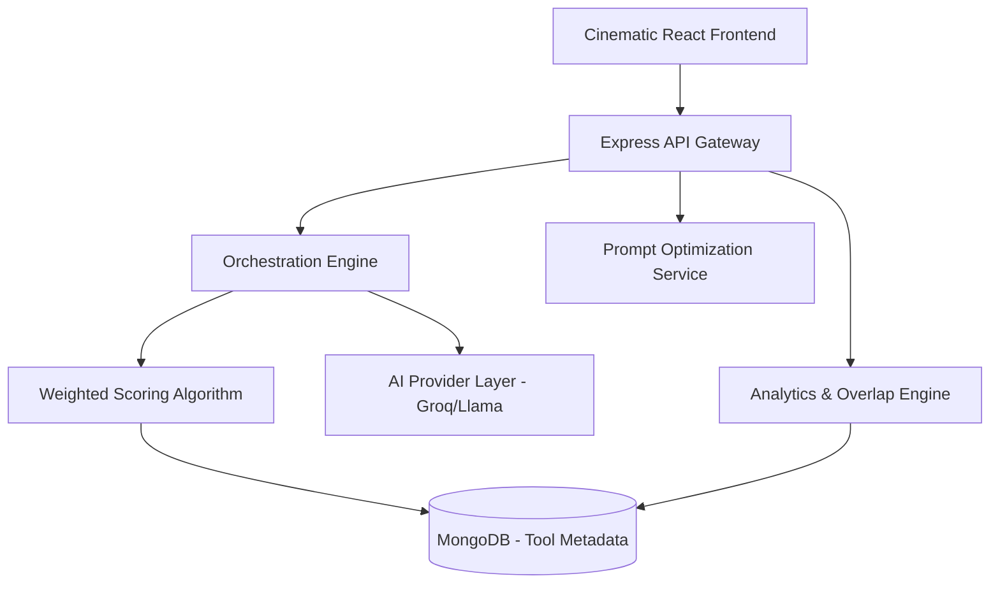

# Algo Lens

### AI Orchestration, Optimization & Workflow Intelligence Platform

Algo Lens is a vendor-neutral AI orchestration and optimization platform designed to help organizations manage the "AI Wild West." It moves beyond simple tool discovery, providing an infrastructure-grade layer for semantic orchestration, redundant subscription optimization, and high-fidelity prompt refinement.

---

[](https://nodejs.org/)
[](https://expressjs.com/)
[](https://www.mongodb.com/)
[](https://react.dev/)
[](https://vitejs.dev/)
[](https://www.framer.com/motion/)
[](https://threejs.org/)
[](https://groq.com/)
[](https://github.com/VimalBisht2021/agent-lensbackend)

---

## 1. Hero Section

Algo Lens is NOT a chatbot wrapper or a simple AI directory. It is a **production-grade AI Operations (AIOps) infrastructure** that empowers enterprises to:

*   **Optimize AI Usage:** Identify and eliminate overlapping tool capabilities.
*   **Reduce Redundant Subscriptions:** Audit spend and find 75%+ semantic tool overlaps.
*   **Orchestrate Workflows:** Generate multi-step, multi-provider tool chains for complex tasks.
*   **Enhance Prompts:** Provider-aware optimization that reduces tokens while increasing clarity.
*   **Compare AI Tools:** Side-by-side technical and economic analysis of the AI ecosystem.
*   **Analyze AI Spend:** Executive dashboards for budget tracking and sustainability metrics.

---

## 2. Vision & Problem Statement

### The "AI Wild West" Problem
Modern organizations are facing **AI Sprawl**. Teams independently adopt disconnected AI tools, leading to:
*   **Rising Costs:** Paying for multiple tools that do the same thing (e.g., ChatGPT, Claude, and Gemini).
*   **Lack of Governance:** No centralized view of which tools are used for which tasks.
*   **Fragmented Workflows:** Inefficient manual handoffs between different AI providers.
*   **Poor Prompt Quality:** High token waste and low-quality outputs due to unoptimized prompts.

### The Algo Lens Solution
Algo Lens acts as the **Intelligence Layer** above your AI stack. It provides:
*   **Unified Orchestration:** A single interface to route tasks to the most efficient provider.
*   **Workflow Intelligence:** Dynamic sequencing of tools based on real-time capability scoring.
*   **Economic Optimization:** Identifying "Wasted Spend" through semantic overlap detection.
*   **Environmental Accountability:** Tracking the carbon and water footprint of every AI request.

---

## 3. Core Features

### 🛠️ AI Workflow Recommendation Engine
*   **Dynamic Orchestration:** Generates multi-step workflows (e.g., Research → Content → Image).
*   **Contextual Tool Selection:** Picks tools based on a weighted 99.9-point scoring system.
*   **Provider Diversification:** Prevents vendor lock-in by suggesting complementary providers.
*   **Purpose-Driven Sequencing:** Assigns specific roles (e.g., "Architecture", "Debugging") to each tool in the chain.

### ✍️ Prompt Optimization Engine 2.0
*   **Provider-Aware Refinement:** Tailors prompts specifically for Claude, GPT, or Gemini styles.
*   **Natural Language Formatting:** Automatically converts messy input into structured, professional prompts with bold headings and clear bullet points.
*   **Token Optimization:** Strips redundant markup to reduce inference costs.
*   **Project Intelligence Inference:** Automatically extracts the "Technical Stack," "Domain," and "Complexity" from a simple task description.

### 📊 AI Spend & Overlap Analytics
*   **Semantic Overlap Detection:** Uses Jaccard similarity to find tools with nearly identical feature sets.
*   **Wasted Spend Estimation:** Calculates potential monthly savings by consolidating redundant subscriptions.
*   **Executive Dashboards:** High-level metrics on total AI spend, trees needed for carbon offset, and water usage.

### 🛡️ Zero-Fail AI Architecture
*   **Multi-Tier Model Routing:** Automatically falls back to 8B models (Llama 3.1) if 70B models are rate-limited or fail.
*   **Robust JSON Extraction:** Custom parsing layer that repairs malformed LLM responses and strips markdown artifacts.
*   **Smart Text Salvage:** If AI formatting fails, the engine intelligently salvages raw text to ensure the user always receives a response.
*   **Emergency Heuristics:** Gracefully degrades to local scoring algorithms if all AI providers are unreachable.

### ⚖️ Governance & Frictionless Access
*   **Global Guest Context:** Implements a transparent middleware that automatically injects a default organizational context for unauthenticated users, enabling a frictionless "Tool-First" onboarding experience.
*   **Policy Simulation:** Predicts the impact of changing organization-wide tool restrictions.
*   **Compliance Auditing:** Ensures workflows adhere to organizational privacy and security standards.

---

## 4. Prompt Optimization Deep Dive

The Prompt Optimization Engine uses **Project Intelligence** to transform vague requests into engineering-grade instructions.

### How it Works:
1.  **Input Cleaning:** Strips existing XML/HTML tags to prevent context pollution.
2.  **Domain Analysis:** Detects the domain (e.g., "Video Production", "Fintech") using regex-based signal detection.
3.  **AI Refinement:** Passes the task to Llama 3.3 (via Groq) to rewrite the prompt using provider-specific best practices.
4.  **Metadata Extraction:** Returns a structured object containing:
    *   **Inferred Stack:** Identified technologies (React, Node, etc.).
    *   **Clarity Score:** Assessment of how well-defined the task is (0-100).
    *   **Risks:** Detection of technical debt or security exposures in the prompt.

### Example Response:
```json
{
  "optimizedPrompt": "**Task:** Generate a Video\n**Context:** Cinematic Trailer style...\n**Constraints:** 1080p, 60fps...",
  "projectIntelligence": {
    "inferredDomain": "Video Production",
    "complexity": "high",
    "clarityScore": 92,
    "inferredStack": ["FFmpeg", "GPU Rendering"]
  }
}
```

---

## 5. System Architecture

Algo Lens is built as a **Layered Intelligence Monolith**, optimized for low-latency AI orchestration.



*   **Semantic Orchestration:** Combines keyword matching with LLM-based reasoning.
*   **Model Hierarchy:** Smart routing between Llama 3.3 (70B) and Llama 3.1 (8B) based on task complexity.
*   **Weighted Scoring:** Accounts for price, context window, popularity, and category fit.
*   **Intelligent Extraction:** Multi-layer JSON repair and text salvage for zero-fail output.
*   **Explainable AI Routing:** Every recommendation includes an "AI Reasoning" block explaining *why* specific tools were chosen.

---

## 6. Tech Stack

### Frontend (Cinematic UI)
*   **React 19:** Utilizing the latest concurrent rendering features.
*   **Vite:** Ultra-fast HMR and build pipelines.
*   **Tailwind CSS 4:** Modern utility-first styling with high-performance CSS-in-JS.
*   **Framer Motion:** For fluid, orchestration-inspired transitions.
*   **Three.js:** Powering the futuristic, data-heavy visualizations.
*   **Recharts:** Dynamic SVG-based analytics components.

### Backend (Infrastructure Layer)
*   **Node.js & Express.js:** Scalable async request handling.
*   **MongoDB & Mongoose:** Schema-flexible storage for evolving AI tool metadata.
*   **Groq SDK:** High-speed inference for real-time orchestration logic.
*   **Winston:** Centralized, production-grade logging.

### AI & Intelligence
*   **Llama 3.3 70B (Groq):** Primary reasoning engine for high-fidelity orchestration.
*   **Llama 3.1 8B (Groq):** High-availability fallback model with simplified 'lightweight' schemas.
*   **Hybrid Scoring Algorithm:** Proprietary deterministic logic for real-time tool ranking.
*   **Semantic extraction:** Advanced JSON repair logic for resilient cross-provider data parsing.

---

## 7. Project Folder Structure

### Backend
```text
src/
├── algorithms/      # Weighted scoring & semantic overlap logic
├── controllers/     # API request handlers (Tools, Prompts, Analytics)
├── models/          # Mongoose Schemas (AITool, Organization, Workflow)
├── routes/          # Express route definitions
├── services/        # Business logic (Prompt Optimization, Analytics)
├── ai-providers/    # Wrappers for Groq, OpenAI, etc.
└── middleware/      # Auth, Rate Limiting, Error Handling
```

### Frontend
```text
src/
├── components/      # UI components (GlassCard, GlowButton)
├── features/        # Business-specific logic (Recommendations, Prompts)
├── pages/           # High-level route components (Dashboard, Tools)
├── services/        # Axios API client abstractions
├── theme/           # Global styles and Tailwind configurations
└── layouts/         # Persistent UI shell (Sidebar, Topbar)
```

---

## 8. API Documentation

### Orchestration & Recommendations
*   **`POST /api/recommendations`**
    *   **Purpose:** Generate a multi-tool orchestration flow.
    *   **Body:** `{ "task": "string", "budget": "low|med|high", "priority": "quality|speed|cost" }`
    *   **Response:** Returns `orchestrationFlow`, `estimatedCostUSD`, and `aiReasoning`.

### Prompt Optimization
*   **`POST /api/prompts/enhance`**
    *   **Purpose:** Optimize a prompt for a specific provider.
    *   **Body:** `{ "prompt": "string", "tool": "claude|gpt|default" }`
    *   **Response:** Returns `optimizedPrompt` and `projectIntelligence`.

### AI Tool Analytics
*   **`GET /api/tools/compare`**
    *   **Purpose:** Side-by-side comparison of tools.
    *   **Query:** `?toolIds=id1,id2`
*   **`GET /api/analytics/executive`**
    *   **Purpose:** Fetch high-level spend and overlap insights.

---

## 9. AI Orchestration Engine

The heart of Algo Lens is the **Weighted Multi-Criteria Scoring Algorithm**.

### Intelligence Categories:
The engine is specialized across 10 core domains:
*   **Coding & Architecture:** backend, frontend, devops, system design.
*   **Research & Data Science:** fact-checking, ML, data analysis.
*   **Content & Creative:** image, video, audio production.
*   **Operations:** automation, security, productivity, presentation.

### How it Scores:
*   **Exact Match (1.5x):** Highest weight for exact capability alignment.
*   **Category Bonus (+15%):** Heavy priority given to tools in the primary task domain.
*   **Economic Adjustment:** Penalizes expensive tools when budget is "low".
*   **Speed Factor:** Rewards high context windows and "fast" strengths when priority is "speed".

---

## 10. Frontend Experience

Algo Lens follows a **Cinematic UI Philosophy**, treating AI orchestration as a high-stakes command center.

*   **Glassmorphism:** Frosted-glass components with dynamic glow effects.
*   **Animated Orchestration:** Workflow steps reveal themselves with staggered Framer Motion animations.
*   **Executive Dashboards:** Interactive Recharts that visualize "Trees Needed" vs "Water Used," grounding AI usage in environmental reality.
*   **High-Fidelity Interaction:** Hover-sensitive glow buttons and GSAP-powered entrance sequences create a premium, futuristic feel.

---

## 11. Installation & Setup

### 1. Clone the Repositories
```bash
git clone https://github.com/VimalBisht2021/agent-lensbackend.git
git clone [frontend-repo-url]
```

### 2. Backend Setup
```bash
cd backend
npm install
# Create .env with:
# MONGO_URI, GROQ_API_KEY, PORT=5000
npm run dev
```

### 3. Seed the Database
```bash
node src/seed/seedTools.js
```

### 4. Frontend Setup
```bash
cd frontend
npm install
# Create .env with:
# VITE_API_URL=http://localhost:5000
npm run dev
```

---

## 12. Future Roadmap

*   **Vector Embeddings:** Implement Pinecone for 100% semantic tool discovery.
*   **Local Model Orchestration:** Integrate Ollama for on-prem, zero-cost task execution.
*   **Autonomous Workflows:** Auto-execute the generated tool chains via API handoffs.
*   **Real-time Collaboration:** Multi-user shared orchestration canvases.
*   **Enterprise Governance Engine:** Deeper policy controls and RBAC for department-level AI budgets.

---

## 13. Why Algo Lens is Different

| Feature | Algo Lens | AI Marketplaces | Chatbot Wrappers |
| :--- | :--- | :--- | :--- |
| **Philosophy** | **Operations & Infrastructure** | Directory / SEO | Simple UI Layer |
| **Logic** | **Multi-Tool Orchestration** | One tool at a time | Single provider |
| **Intelligence** | **Deterministic + LLM Scoring** | Star ratings | None |
| **Sustainability** | **Water/Carbon Tracking** | None | None |
| **Governance** | **Policy Enforcement** | None | None |

---

## Final Conclusion

Algo Lens is the **Bloomberg Terminal for AI Workflow Intelligence**. It transforms the way organizations view their AI stack—from a collection of disconnected subscriptions to a highly optimized, orchestrated, and explainable engine of operational efficiency.
